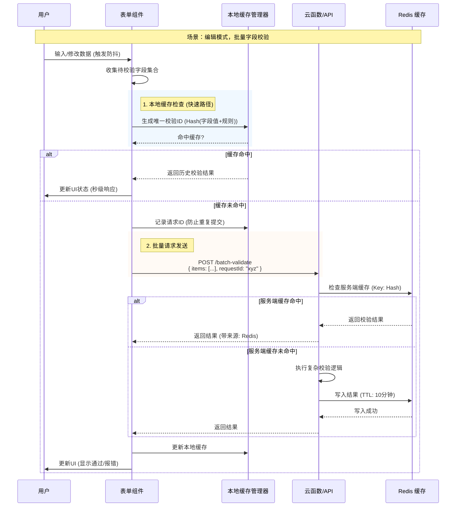

# 表单批量校验

```sh

针对表单中校验比较多的场景，特别是编辑时

- 批处理校验：校验，批量校验，通过则过滤掉，未通过，继续校验，可以缓存校验结果

- 批量请求，请求id
  - 缓存段，记录结果
  - 每次请求，唯一id 缓存到本地
  - 云函数，可以使用 Redis 缓存
针对这种场景，完善一下，可以画图画出来流程图
```

针对你提出的“表单批量校验”与“基于唯一ID的缓存机制”场景，这是一个非常典型且高价值的**高性能表单架构**设计。

特别是在编辑场景下，数据量大且重复提交频繁，通过**本地缓存（防抖/去重）**和**服务端缓存（Redis）**的双重保障，可以极大地提升用户体验并降低服务器压力。

下面我为你完善这套方案，并绘制相应的流程图。

### 🏗️ 核心架构设计

我们将整个校验流程分为三个层级：
1.  **交互层（UI）**：防抖输入、批量触发。
2.  **逻辑层（Client）**：请求去重（唯一ID）、本地缓存（LRU）、结果聚合。
3.  **服务层（Server/Cloud）**：Redis 缓存、原子性校验。

### 📊 流程图

这个流程图展示了从用户输入到最终校验结果返回的完整闭环。



### 🛠️ 详细实现方案

#### 唯一 ID 生成策略
为了实现缓存，我们需要一个能够唯一标识“这次校验”的 ID。
- **生成规则**：`Hash(字段名 + 字段值 + 校验规则版本)`
- **作用**：只要值没变，生成的 ID 就不变，可以直接复用结果。

#### 本地缓存管理器
我们需要一个简单的管理器来处理“缓存段”和“请求去重”。

```javascript
// utils/validatorCache.js

class ValidatorCache {
  constructor() {
    this.cache = new Map(); // 存储校验结果
    this.pendingRequests = new Set(); // 存储正在请求中的 ID (防重复提交)
  }

  // 生成唯一 ID (简单版可以用 JSON.stringify，生产建议用 md5/js-sha256)
  generateId(field, value, rules) {
    return `${field}:${JSON.stringify(value)}:${JSON.stringify(rules)}`;
  }

  // 尝试获取缓存
  get(id) {
    if (this.cache.has(id)) {
      console.log(`✅ 命中本地缓存: ${id}`);
      return this.cache.get(id);
    }
    return null;
  }

  // 标记请求正在进行
  isPending(id) {
    return this.pendingRequests.has(id);
  }

  // 设置请求状态
  setPending(id, status) {
    if (status) {
      this.pendingRequests.add(id);
    } else {
      this.pendingRequests.delete(id);
    }
  }

  // 保存结果
  set(id, result) {
    this.cache.set(id, {
      ...result,
      timestamp: Date.now()
    });
    // 可选：实现 LRU 淘汰策略，防止内存溢出
  }
}

export const validatorCache = new ValidatorCache();
```

#### 批量校验逻辑
在表单组件中，将分散的校验规则聚合。

```javascript
// hooks/useBatchValidate.js
import { validatorCache } from '../utils/validatorCache';

const API_URL = '/api/cloud-function/validate';

export const useBatchValidate = () => {
  const validateBatch = async (items) => {
    // 1. 分组：分为“本地有缓存”和“需要请求”两组
    const cachedResults = {};
    const requestItems = [];

    items.forEach(item => {
      const id = validatorCache.generateId(item.name, item.value, item.rules);
      const cached = validatorCache.get(id);

      if (cached) {
        cachedResults[item.name] = cached;
      } else if (!validatorCache.isPending(id)) {
        requestItems.push({ ...item, _id: id }); // 附带生成的 ID
        validatorCache.setPending(id, true); // 标记为请求中
      }
    });

    // 2. 请求：如果有需要网络请求的项
    if (requestItems.length > 0) {
      try {
        const response = await fetch(API_URL, {
          method: 'POST',
          body: JSON.stringify({ items: requestItems })
        });
        const results = await response.json();

        // 3. 回填：更新本地缓存
        results.forEach(res => {
          validatorCache.set(res._id, res); // 保存结果
          validatorCache.setPending(res._id, false); // 移除请求标记
          cachedResults[res.fieldName] = res; // 放入最终结果
        });
      } catch (e) {
        // 错误处理
      }
    }

    return cachedResults;
  };

  return { validateBatch };
};
```

#### 云函数与 Redis 策略
在服务端，利用 Redis 进一步减少计算。

**Redis Key 设计**：
- `validate:batch:{hash}` -> 存储校验结果 JSON
- **TTL**：建议设置较短时间（如 5-10 分钟），因为编辑场景下数据变化快，旧缓存意义不大。

**云函数伪代码**：
```javascript
exports.validateHandler = async (req, res) => {
  const { items } = req.body;
  const redisClient = getRedisClient();
  const results = [];

  for (const item of items) {
    const cacheKey = `validate:${md5(JSON.stringify(item))}`;
    
    // 1. 查 Redis
    let result = await redisClient.get(cacheKey);
    
    if (result) {
      result = JSON.parse(result);
    } else {
      // 2. 执行真实校验逻辑 (数据库查重、正则等)
      result = await performHeavyValidation(item);
      
      // 3. 写 Redis (10分钟过期)
      await redisClient.setEx(cacheKey, 600, JSON.stringify(result));
    }
    
    results.push({ ...result, _id: item._id });
  }

  res.json(results);
};
```

### 🚀 优化亮点总结

1.  **过滤机制**：
    - 在 `validateBatch` 函数中，通过 `items.filter` 逻辑，只有“未通过本地缓存校验”的数据才会被打包发送。这大大减少了网络包的大小。
2.  **防抖与去重**：
    - 输入框使用 `debounce`。
    - 请求管理器使用 `pendingRequests` Set，防止用户快速连续触发导致同一数据被重复发送。
3.  **双重缓存**：
    - 本地 Map 缓存：解决“手滑改回去”的场景（毫秒级响应）。
    - Redis 缓存：解决多人协作或刷新页面后的场景（秒级响应）。
4.  **唯一 ID 追踪**：
    - 前端生成的 `_id` 会原样带回，确保异步返回的结果能准确对应到具体的表单项上。

这套方案非常适合**SaaS 后台、电商商品编辑、复杂配置中心**等对数据准确性要求高且字段繁多的场景。