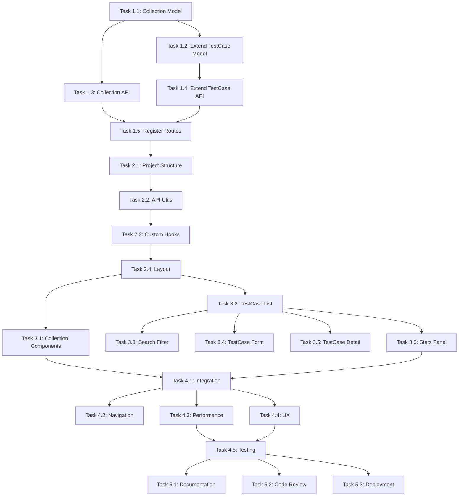

# 测试案例记录系统 - 任务分解

## 任务概览

本文档将需求规格说明书 (spec.md) 中的功能需求分解为可执行的具体任务。

---

## Phase 1: 后端开发（第 1-2 天）

### Task 1.1: 创建 TestCaseCollection Model
**优先级**: High  
**预计时间**: 2 小时  
**文件**: `src/model/jsondb/TestCaseCollection.js`

**任务详情**:
- [ ] 创建 TestCaseCollection 类
- [ ] 实现 connect() 方法初始化数据库
- [ ] 实现 create() 创建集合
- [ ] 实现 findById() 查找集合
- [ ] 实现 find() 查询集合列表
- [ ] 实现 update() 更新集合
- [ ] 实现 delete() 删除集合
- [ ] 实现 getStats() 获取统计信息
- [ ] 添加默认集合初始化逻辑

**验收标准**:
- Model 类可以正常实例化
- 所有 CRUD 方法正常工作
- 默认集合自动创建

---

### Task 1.2: 扩展 TestCase Model
**优先级**: High  
**预计时间**: 1 小时  
**文件**: `src/model/jsondb/TestCase.js`

**任务详情**:
- [ ] 添加 collectionId 字段支持
- [ ] 添加 findByCollectionId() 方法
- [ ] 添加 getCollectionStats() 方法
- [ ] 优化 find() 方法支持集合过滤
- [ ] 添加索引定义

**验收标准**:
- 案例可以关联到集合
- 按集合查询性能良好
- 统计信息包含集合维度

---

### Task 1.3: 创建集合管理 API
**优先级**: High  
**预计时间**: 2 小时  
**文件**: `src/http-server/test-case-collection-api.js`

**任务详情**:
- [ ] 创建 Express Router
- [ ] 实现 GET /api/test-case-collections
- [ ] 实现 POST /api/test-case-collections
- [ ] 实现 GET /api/test-case-collections/:id
- [ ] 实现 PUT /api/test-case-collections/:id
- [ ] 实现 DELETE /api/test-case-collections/:id
- [ ] 实现 GET /api/test-case-collections/:id/cases
- [ ] 实现 GET /api/test-case-collections/stats
- [ ] 添加数据库初始化中间件
- [ ] 添加错误处理

**验收标准**:
- 所有 API 端点正常工作
- 响应格式统一
- 错误处理完善

---

### Task 1.4: 扩展测试案例 API
**优先级**: Medium  
**预计时间**: 1 小时  
**文件**: `src/http-server/test-case-api.js`

**任务详情**:
- [ ] 添加 collectionId 参数支持
- [ ] 添加集合维度的统计接口
- [ ] 优化搜索逻辑支持多集合
- [ ] 添加批量关联集合功能

**验收标准**:
- 案例 API 支持集合过滤
- 统计接口返回集合维度数据

---

### Task 1.5: 注册路由和中间件
**优先级**: High  
**预计时间**: 30 分钟  
**文件**: `src/http-server/static.js`

**任务详情**:
- [ ] 导入集合 API 路由
- [ ] 注册 /api/test-case-collections 路由
- [ ] 确保路由顺序正确
- [ ] 测试 API 连通性

**验收标准**:
- 路由正确注册
- API 可以正常访问

---

## Phase 2: 前端开发 - 基础框架（第 2-3 天）

### Task 2.1: 搭建项目结构
**优先级**: High  
**预计时间**: 1 小时  
**目录**: `public/test-case-manager/`

**任务详情**:
- [ ] 创建 index.html 主页面
- [ ] 创建 css/style.css 样式文件
- [ ] 创建 js/ 目录结构
- [ ] 配置 React + Babel CDN
- [ ] 配置 Ant Design CDN
- [ ] 创建基础 HTML 结构

**验收标准**:
- 页面可以正常加载
- React 和 Ant Design 可用
- 目录结构清晰

---

### Task 2.2: 实现 API 封装
**优先级**: High  
**预计时间**: 1.5 小时  
**文件**: `public/test-case-manager/js/utils/api.js`

**任务详情**:
- [ ] 创建 request() 基础方法
- [ ] 实现 get() 方法
- [ ] 实现 post() 方法
- [ ] 实现 put() 方法
- [ ] 实现 delete() 方法
- [ ] 添加错误处理
- [ ] 添加请求超时
- [ ] 统一响应格式处理

**验收标准**:
- API 调用简洁方便
- 错误处理统一
- 支持取消请求

---

### Task 2.3: 实现自定义 Hooks
**优先级**: High  
**预计时间**: 3 小时  

**文件**: `public/test-case-manager/js/hooks/useTestCase.js`
- [ ] 实现 useTestCaseList() 获取案例列表
- [ ] 实现 useTestCase() 获取单个案例
- [ ] 实现 useCreateTestCase() 创建案例
- [ ] 实现 useUpdateTestCase() 更新案例
- [ ] 实现 useDeleteTestCase() 删除案例
- [ ] 实现 useBatchDelete() 批量删除
- [ ] 实现 useTestCaseStats() 统计信息
- [ ] 实现 useApiNames() 接口名列表
- [ ] 实现 useTags() 标签列表

**文件**: `public/test-case-manager/js/hooks/useCollection.js`
- [ ] 实现 useCollectionList() 获取集合列表
- [ ] 实现 useCollection() 获取单个集合
- [ ] 实现 useCreateCollection() 创建集合
- [ ] 实现 useUpdateCollection() 更新集合
- [ ] 实现 useDeleteCollection() 删除集合
- [ ] 实现 useCollectionCases() 获取集合下的案例

**验收标准**:
- Hooks 使用简单
- 状态管理清晰
- 加载状态处理
- 错误处理完善

---

### Task 2.4: 实现布局组件
**优先级**: High  
**预计时间**: 2 小时  
**文件**: `public/test-case-manager/js/components/Layout.jsx`

**任务详情**:
- [ ] 创建 Header 组件（导航栏）
- [ ] 创建 Sidebar 组件（侧边栏）
- [ ] 创建 MainContent 组件（主内容区）
- [ ] 实现响应式布局
- [ ] 实现路由切换（案例列表/集合管理）
- [ ] 添加全局样式

**验收标准**:
- 布局结构清晰
- 响应式适配良好
- 导航切换正常

---

## Phase 3: 前端开发 - 核心功能（第 3-4 天）

### Task 3.1: 实现集合管理组件
**优先级**: High  
**预计时间**: 3 小时  

**文件**: `public/test-case-manager/js/components/CollectionList.jsx`
- [ ] 创建集合列表表格
- [ ] 实现创建集合按钮
- [ ] 实现编辑集合功能
- [ ] 实现删除集合功能
- [ ] 实现集合详情查看
- [ ] 实现集合切换
- [ ] 添加统计信息展示

**文件**: `public/test-case-manager/js/components/CollectionForm.jsx`
- [ ] 创建集合表单
- [ ] 实现表单验证
- [ ] 实现保存功能
- [ ] 实现取消功能

**验收标准**:
- 集合 CRUD 功能完整
- 表单验证正确
- 交互流畅

---

### Task 3.2: 实现案例列表组件
**优先级**: High  
**预计时间**: 4 小时  
**文件**: `public/test-case-manager/js/components/TestCaseList.jsx`

**任务详情**:
- [ ] 创建数据表格（Ant Design Table）
- [ ] 实现分页器
- [ ] 实现行点击查看详情
- [ ] 实现批量选择
- [ ] 实现批量删除
- [ ] 实现快速编辑
- [ ] 实现快速删除
- [ ] 添加加载状态
- [ ] 添加空状态

**验收标准**:
- 表格展示正常
- 分页功能正确
- 批量操作可用
- 性能良好

---

### Task 3.3: 实现搜索筛选组件
**优先级**: High  
**预计时间**: 2 小时  
**文件**: `public/test-case-manager/js/components/SearchFilter.jsx`

**任务详情**:
- [ ] 创建关键词搜索框
- [ ] 创建集合选择器
- [ ] 创建接口名选择器
- [ ] 创建标签选择器
- [ ] 实现防抖搜索
- [ ] 实现筛选条件重置
- [ ] 实现排序选择器
- [ ] 添加筛选条件展示

**验收标准**:
- 搜索功能准确
- 筛选条件生效
- 响应及时

---

### Task 3.4: 实现案例表单组件
**优先级**: High  
**预计时间**: 4 小时  
**文件**: `public/test-case-manager/js/components/TestCaseForm.jsx`

**任务详情**:
- [ ] 创建基本信息表单（接口名、标题）
- [ ] 创建请求参数编辑器（Textarea）
- [ ] 创建返回数据编辑器（Textarea）
- [ ] 创建备注输入框
- [ ] 创建标签管理器
- [ ] 创建请求时间选择器
- [ ] 实现 String 转 JSON 功能
- [ ] 实现表单验证
- [ ] 实现保存功能
- [ ] 实现取消功能
- [ ] 实现复制功能

**验收标准**:
- 表单字段完整
- JSON 转换正常
- 标签管理方便
- 验证逻辑正确

---

### Task 3.5: 实现案例详情组件
**优先级**: Medium  
**预计时间**: 2 小时  
**文件**: `public/test-case-manager/js/components/TestCaseDetail.jsx`

**任务详情**:
- [ ] 创建详情展示卡片
- [ ] 实现 JSON 格式化显示
- [ ] 实现代码高亮
- [ ] 实现一键复制
- [ ] 实现快速编辑入口
- [ ] 实现关闭功能
- [ ] 添加美观的样式

**验收标准**:
- 详情展示清晰
- JSON 格式化美观
- 复制功能可用

---

### Task 3.6: 实现统计面板组件
**优先级**: Medium  
**预计时间**: 2 小时  
**文件**: `public/test-case-manager/js/components/StatsPanel.jsx`

**任务详情**:
- [ ] 创建统计卡片（总数、集合数等）
- [ ] 实现按集合统计图表
- [ ] 实现按标签统计图表
- [ ] 实现按接口统计图表
- [ ] 实现近期案例列表
- [ ] 添加数据可视化（可选 ECharts）

**验收标准**:
- 统计数据准确
- 图表展示美观
- 数据实时更新

---

## Phase 4: 集成与优化（第 5 天）

### Task 4.1: 集成到主系统
**优先级**: High  
**预计时间**: 1 小时  
**文件**: `src/http-server/static.js`

**任务详情**:
- [ ] 注册 test-case-manager 路由
- [ ] 配置静态资源
- [ ] 配置 HTML 文件服务
- [ ] 测试路由冲突

**验收标准**:
- 可以通过 URL 访问
- 静态资源加载正常

---

### Task 4.2: 添加导航链接
**优先级**: Medium  
**预计时间**: 30 分钟  
**文件**: `public/index.html`

**任务详情**:
- [ ] 在首页添加工具卡片
- [ ] 添加测试案例管理入口
- [ ] 更新 dev.js 的工具列表
- [ ] 更新常用页面列表

**验收标准**:
- 首页可以进入
- 导航链接正确

---

### Task 4.3: 性能优化
**优先级**: Medium  
**预计时间**: 2 小时  

**任务详情**:
- [ ] 实现虚拟滚动（大数据量）
- [ ] 添加请求缓存
- [ ] 优化渲染性能
- [ ] 添加骨架屏
- [ ] 优化打包体积
- [ ] 添加懒加载

**验收标准**:
- 页面加载时间 < 1s
- 操作流畅
- 内存占用合理

---

### Task 4.4: 用户体验优化
**优先级**: Medium  
**预计时间**: 2 小时  

**任务详情**:
- [ ] 添加加载提示
- [ ] 添加成功提示
- [ ] 添加错误提示
- [ ] 实现快捷键（ESC、Enter 等）
- [ ] 添加确认对话框
- [ ] 优化动画效果
- [ ] 添加空状态引导

**验收标准**:
- 交互反馈明确
- 快捷键可用
- 用户体验流畅

---

### Task 4.5: 测试与调试
**优先级**: High  
**预计时间**: 3 小时  

**任务详情**:
- [ ] 功能测试（所有 CRUD）
- [ ] 边界测试（空数据、大数据量）
- [ ] 兼容性测试（主流浏览器）
- [ ] 性能测试（1000+ 案例）
- [ ] 修复发现的 Bug
- [ ] 编写测试文档

**验收标准**:
- 所有功能正常
- 无控制台错误
- 性能达标

---

## Phase 5: 文档与部署（第 6 天）

### Task 5.1: 编写使用文档
**优先级**: Low  
**预计时间**: 1 小时  
**文件**: `docs/test-case-manager/README.md`

**任务详情**:
- [ ] 编写功能介绍
- [ ] 编写使用指南
- [ ] 编写 API 文档
- [ ] 添加截图示例
- [ ] 编写常见问题

**验收标准**:
- 文档清晰完整
- 示例准确

---

### Task 5.2: 代码审查与优化
**优先级**: Medium  
**预计时间**: 2 小时  

**任务详情**:
- [ ] 代码规范检查
- [ ] 删除死代码
- [ ] 优化注释
- [ ] 统一命名
- [ ] 提取公共逻辑
- [ ] 添加类型注释

**验收标准**:
- 代码质量高
- 可维护性好

---

### Task 5.3: 部署验证
**优先级**: High  
**预计时间**: 1 小时  

**任务详情**:
- [ ] 本地启动服务器
- [ ] 验证所有功能
- [ ] 检查数据持久化
- [ ] 验证默认数据
- [ ] 编写部署检查清单

**验收标准**:
- 系统稳定运行
- 数据保存正常

---

## 任务优先级矩阵

| 优先级 | 任务数量 | 说明 |
|--------|---------|------|
| High   | 15      | 必须完成的核心功能 |
| Medium | 10      | 重要的增强功能 |
| Low    | 2       | 可选的优化功能 |

---

## 依赖关系

---

## 进度跟踪

使用以下工具跟踪进度：
- ✅ 已完成
- 🔄 进行中
- ⏳ 待开始
- ❌ 已阻塞

---

## 风险管理

| 风险 | 可能性 | 影响 | 缓解措施 |
|------|--------|------|---------|
| JSONDB 性能问题 | 中 | 高 | 添加索引、优化查询 |
| React 性能问题 | 低 | 中 | 使用虚拟滚动、memo |
| 浏览器兼容性 | 低 | 低 | 使用 Babel 转译 |
| 数据丢失 | 中 | 高 | 定期备份、导出功能 |

---

## 验收清单

### 功能验收
- [ ] 集合管理 CRUD
- [ ] 案例管理 CRUD
- [ ] 搜索筛选
- [ ] 统计分析
- [ ] 批量操作

### 性能验收
- [ ] 加载时间 < 1s
- [ ] 响应时间 < 300ms
- [ ] 支持 1000+ 案例

### 质量验收
- [ ] 无控制台错误
- [ ] 代码规范
- [ ] 文档完整
- [ ] 测试通过

---

**文档版本**: v1.0  
**创建时间**: 2026-05-13  
**最后更新**: 2026-05-13
