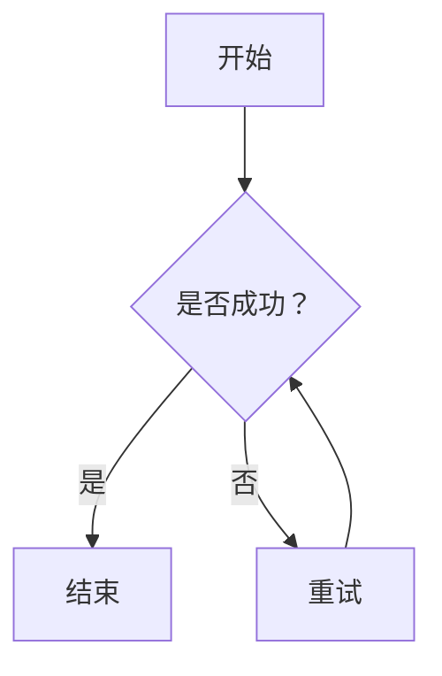
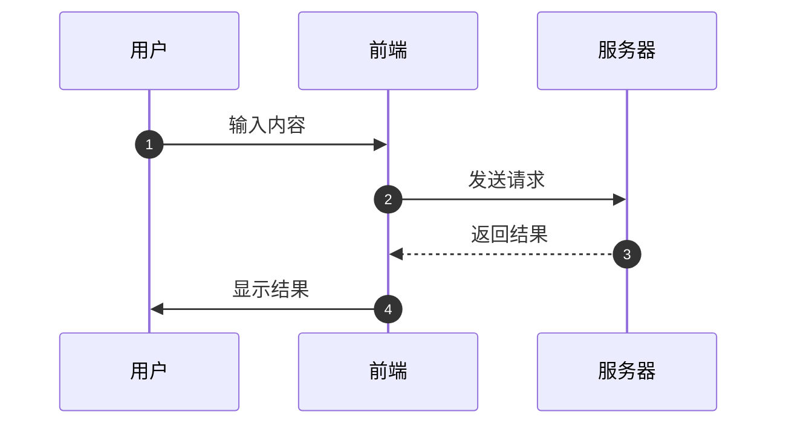
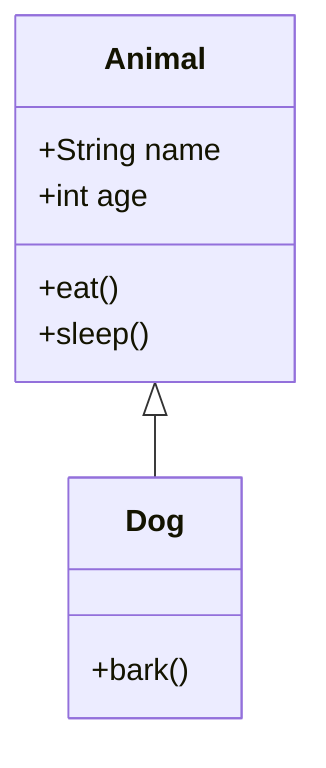
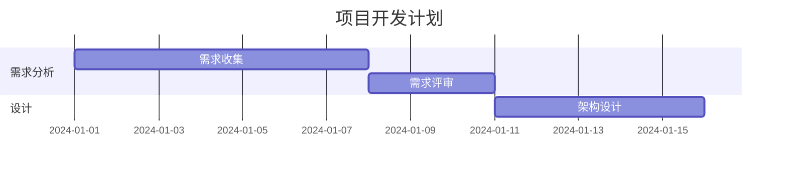
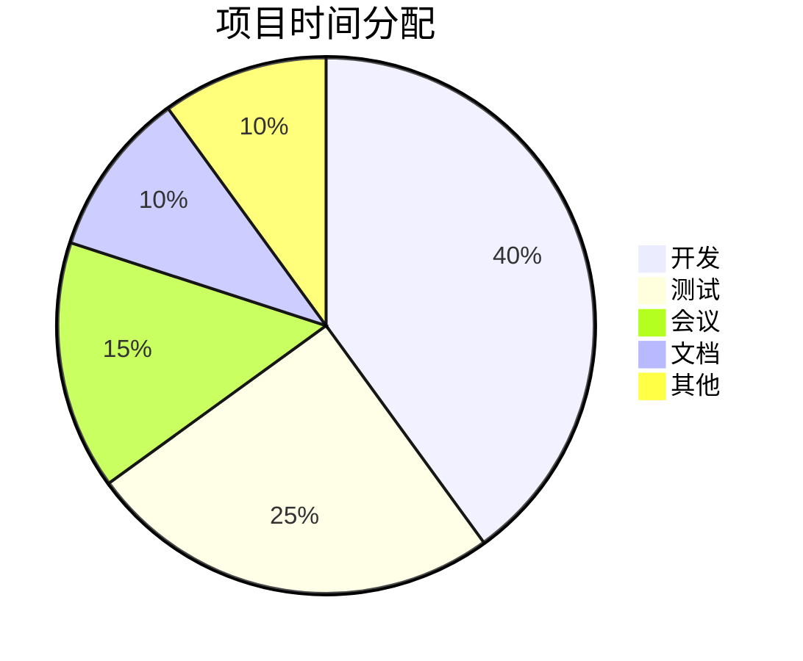
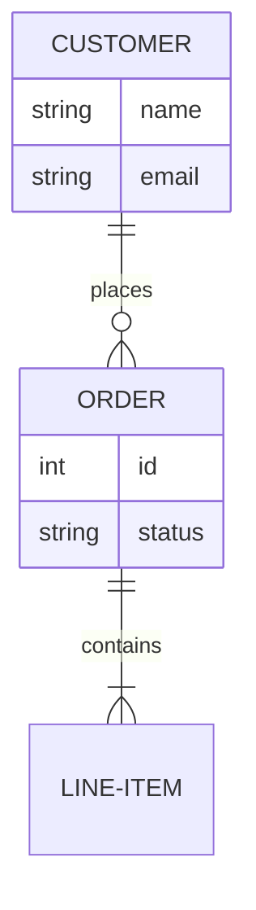
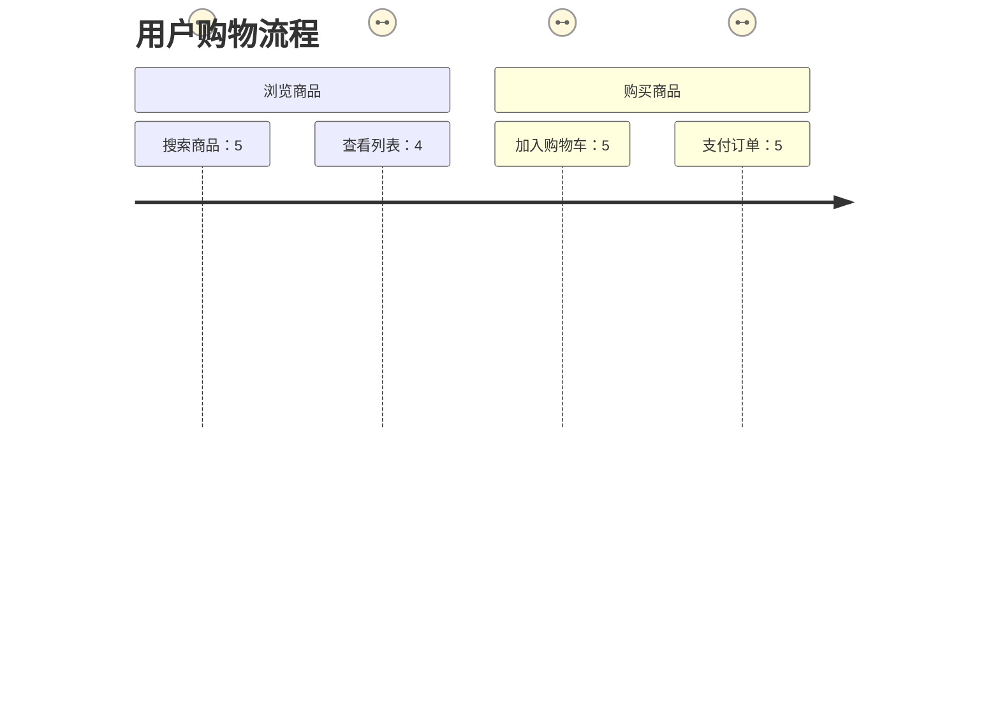
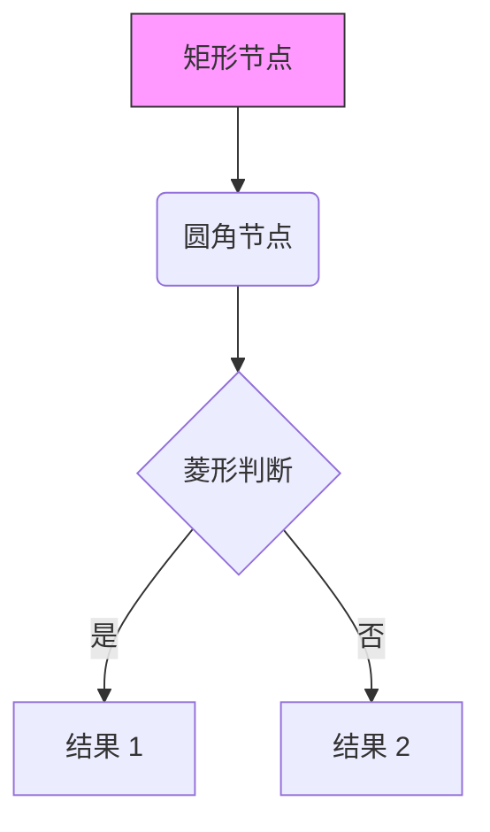
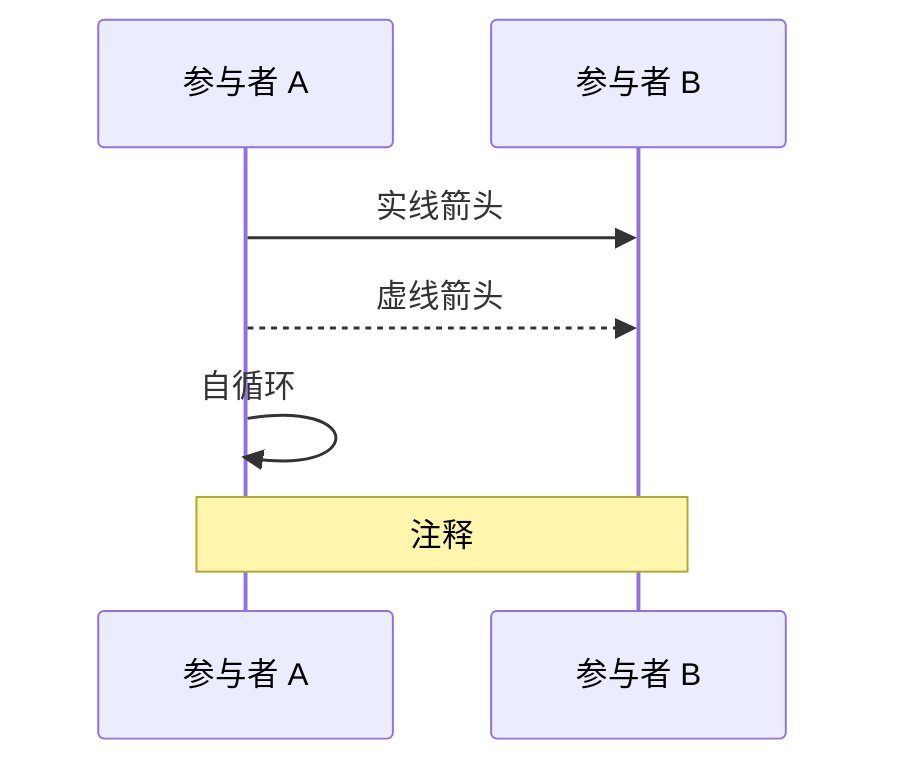
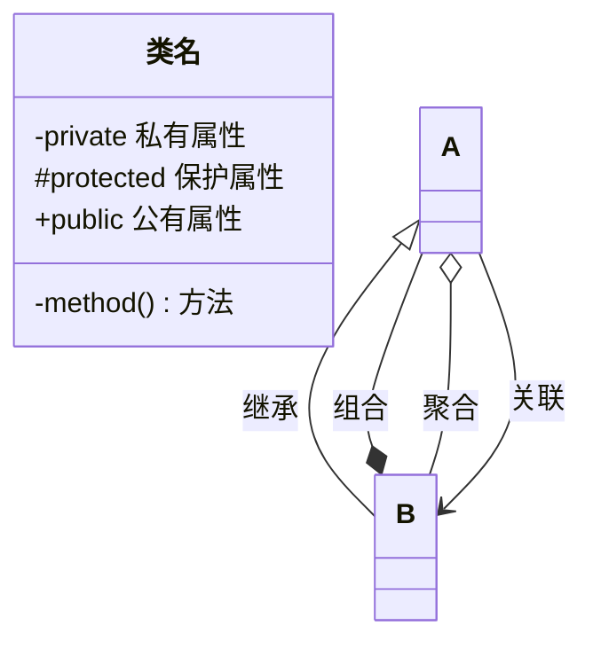

# 📊 Mermaid 编辑器 - 使用文档

> 📅 创建时间：2026-03-15
> 📋 实时渲染 Mermaid 图表工具

---

## 🎯 功能概述

Mermaid 编辑器是一个基于 Monaco Editor 和 Mermaid.js 的在线图表编辑工具，支持实时预览和导出功能。

**核心功能：**
- ✅ Monaco Editor 代码编辑
- ✅ 实时渲染预览（500ms 防抖）
- ✅ 7 种图表类型支持
- ✅ SVG/PNG 格式导出
- ✅ 缩放控制（30%-300%）
- ✅ 示例代码快速加载
- ✅ 错误提示

---

## 🚀 快速开始

### 访问地址

```bash
# 启动服务
x-static

# 访问 Mermaid 编辑器
http://127.0.0.1:3000/mermaid-editor/
```

### 界面布局

```
┌─────────────────────────────────────────────────────────┐
│  📊 Mermaid 编辑器    [示例] [下载]                     │
├───────────────────────┬─────────────────────────────────┤
│                       │                                 │
│   📝 代码编辑          │    👁️ 实时预览                  │
│   ┌─────────────────┐ │  ┌───────────────────────────┐  │
│   │ graph TD        │ │  │                           │  │
│   │ A --> B         │ │  │    [渲染的图表]            │  │
│   │ B --> C         │ │  │                           │  │
│   └─────────────────┘ │  └───────────────────────────┘  │
│   就绪 | 120 字符     │  [🔍-] [🔍+] [100%]            │
│                       │                                 │
└───────────────────────┴─────────────────────────────────┘
```

---

## 📊 支持的图表类型

### 1. 流程图 (Flowchart)

**按钮：** 📊 流程图

**语法示例：**


**适用场景：**
- 业务流程图
- 算法流程图
- 决策树
- 思维导图

---

### 2. 时序图 (Sequence Diagram)

**按钮：** 📋 时序图

**语法示例：**


**适用场景：**
- 系统交互流程
- API 调用流程
- 对象间消息传递

---

### 3. 类图 (Class Diagram)

**按钮：** 🏷️ 类图

**语法示例：**


**适用场景：**
- UML 类图
- 代码结构设计
- 对象关系展示

---

### 4. 甘特图 (Gantt Chart)

**按钮：** 📅 甘特图

**语法示例：**


**适用场景：**
- 项目进度计划
- 时间安排
- 任务依赖关系

---

### 5. 饼图 (Pie Chart)

**按钮：** 🥧 饼图

**语法示例：**


**适用场景：**
- 数据占比展示
- 比例分析
- 统计图表

---

### 6. 实体关系图 (ER Diagram)

**按钮：** 🗃️ ER 图

**语法示例：**


**适用场景：**
- 数据库设计
- 实体关系建模
- 数据模型展示

---

### 7. 用户旅程图 (Journey Diagram)

**按钮：** 🚶 旅程图

**语法示例：**


**适用场景：**
- 用户体验分析
- 服务流程设计
- 客户旅程映射

---

## 🎨 主题切换

**位置：** 顶部工具栏主题选择器

### 内置主题

| 主题 | 说明 | 适用场景 |
|------|------|----------|
| 🎨 默认 (default) | 蓝白配色 | 通用场景 |
| 🌲 森林 (forest) | 绿色系 | 自然、环保主题 |
| 🌙 深色 (dark) | 深色背景 | 夜间模式、护眼 |
| ⚪ 中性 (neutral) | 灰色系 | 商务、专业 |
| 📄 基础 (base) | 简洁黑白 | 打印、文档 |

### 自定义主题

| 主题 | 说明 | 适用场景 |
|------|------|----------|
| 💾 复古 DOS | 复古彩色字符风 | 怀旧、复古设计 |
| 🍹 夏日果汁 | 鲜艳活泼风格 | 轻松、愉快主题 |
| ✏️ 手绘彩笔 | 手绘彩笔风格 | 创意、手账风格 |
| 🧊 冰蓝理工 | 冰蓝色科技感 | 技术、理科主题 |
| 💜 紫气东来 | 梦幻紫色渐变 | 浪漫、梦幻主题 |
| 🍬 马卡龙 | 多彩马卡龙色 | 甜美、可爱风格 |
| 🤖 赛博朋克 | 霓虹赛博风格 | 未来、科技主题 |

**快捷键：** 无

**说明：**
- 切换主题后自动重新渲染当前图表
- 主题设置会保存到本地存储
- 下次打开时自动恢复上次使用的主题
- 自定义主题使用 `themeVariables` 配置

---

## 🔧 功能操作

### 加载示例

点击顶部示例按钮快速加载对应类型的示例代码：
- 📊 流程图
- 📋 时序图
- 🏷️ 类图
- 📅 甘特图
- 🥧 饼图
- 🗃️ ER 图
- 🚶 旅程图

### 编辑代码

**编辑器快捷键：**
| 快捷键 | 功能 |
|--------|------|
| `Ctrl+S` | 保存 |
| `Ctrl+F` | 查找 |
| `Ctrl+H` | 替换 |
| `Ctrl+Z` | 撤销 |
| `Ctrl+Y` | 重做 |
| `Tab` | 缩进 |

### 格式化代码

点击 ✨ 按钮格式化 Mermaid 代码，使其更易读。

### 清空编辑器

点击 🗑️ 按钮清空当前代码（会弹出确认框）。

### 缩放控制

在预览区域右上角：
- 🔍+ 放大（每次 +10%，最大 300%）
- 🔍- 缩小（每次 -10%，最小 30%）
- 100% 重置缩放

### 导出图表

**下载 SVG：**
1. 点击 📥 下载 SVG 按钮
2. 自动下载当前图表的 SVG 文件
3. 文件命名：`mermaid-时间戳.svg`

**下载 PNG：**
1. 点击 🖼️ 下载 PNG 按钮
2. 自动渲染为 2x 高分辨率 PNG
3. 文件命名：`mermaid-时间戳.png`

---

## 📝 语法参考

### 流程图语法



### 时序图语法



### 类图语法



---

## 🐛 常见问题

### 1. 图表渲染失败

**原因：** Mermaid 语法错误

**解决：**
- 检查错误提示信息
- 点击示例按钮参考正确语法
- 确保节点 ID 不包含特殊字符

### 2. 时序图显示不完整

**原因：** 参与者过多或内容过长

**解决：**
- 使用 `autonumber` 自动编号
- 简化参与者名称（使用 alias）
- 调整预览区域缩放

### 3. 导出的 PNG 模糊

**原因：** 原始 SVG 尺寸较小

**解决：**
- 使用 SVG 格式（矢量图，无限放大不失真）
- 或在代码中添加 `%%{init: {'theme': 'default', 'themeVariables': {}}}%%` 调整

### 4. 中文显示乱码

**原因：** 字体问题

**解决：**
- 确保文件保存为 UTF-8 编码
- Mermaid 默认支持中文，无需特殊配置

---

## 🎨 主题配置

Mermaid 支持多种主题：


**可用主题：**
- `default` - 默认主题
- `forest` - 森林主题
- `dark` - 深色主题
- `neutral` - 中性主题

---

## 📊 性能优化

### 防抖渲染

编辑器内容变化后 500ms 自动渲染，避免频繁刷新。

### 建议

- 大型图表建议先在小范围测试
- 复杂流程图可拆分为多个子图
- 导出前建议重置缩放为 100%

---

## 🔗 相关资源

- [Mermaid 官方文档](https://mermaid.js.org/)
- [Mermaid Live Editor](https://mermaid.live/)
- [Monaco Editor 文档](https://microsoft.github.io/monaco-editor/)
- [打造梦幻又实用的 Mermaid 马卡龙渐变风主题](https://cloud.tencent.com/developer/article/2539391)
---

## 📝 更新日志

### v1.0.0 (2026-03-15)
- ✅ Mermaid 编辑器发布
- ✅ 支持 7 种图表类型
- ✅ Monaco Editor 代码编辑
- ✅ 实时预览
- ✅ SVG/PNG 导出
- ✅ 缩放控制
- ✅ 示例代码

---

*本文档基于 v1.0.0 版本编写。*
